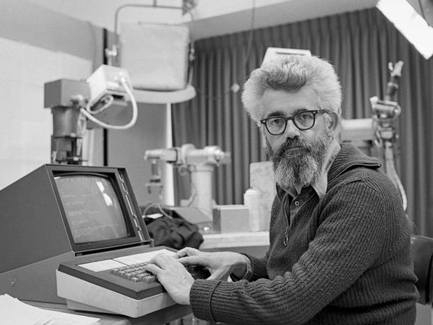

# Introduction to Programming

## with Python

---

# A brief history of programming firsts

---

## Ada Lovelace


1815-1852
The world's first computer programmer
Worked with Charles Babbage on the Analytical Engine

---

## ENIAC


1946
First electronic general-purpose computer
Six women were the programmers:
Kathy Kleiman, Jean Bartik, Marlyn Meltzer, Kay Antonelli, Betty Holberton, Frances Spence

---

## Grace Hopper


1906–1992
Created the first compiler
Popularized the term "bug"

---

## LISP



1958
Created by John McCarthy
Influence on many modern languages, including Python

---

## ALGOL


1958
Designed by a committee of European and American computer scientists
Other major influence on modern languages, particularly syntactically

---

## Margaret Hamilton


1936-
Director of software engineering for the Apollo space program
Developed concepts that power modern software design
Coined the term "software engineering"

---

# Concepts of programming

---

## Major concepts

* Variables
* If/then
* Loops
* Functions
* Libraries
* Programs

---

# Hello World

---

```py
print("Hello, world!")

# => Hello, world!
```
---

## Variables

```py
person = "Allison"
print("Hello, " + person + "!")

# => Hello, Allison!
```

---

## If/then

```py
name = input("What is your name? ")
if name == "":
    print("Hello world!")
else:
    print("Hello, " + name + "!")

# => What is your name? Allison
#    Hello, Allison!
```

---

## Loops

```py
name = input("What is your name? ")
number_of_hellos = 3
current_num = 0
while current_num < number_of_hellos:
    print("Hello, " + name + "!")
    current_num = current_num + 1
print("Goodbye, " + name + "!")

# => What is your name? Allison
#    Hello, Allison!
#    Hello, Allison!
#    Hello, Allison!
#    Goodbye, Allison!
```

---

## Functions

```py
def get_name():
    return input("What is your name? ")

def greet(name):
    return "Hello, " + name + "!"

name = get_name()
print(greet(name))

# => What is your name? Allison
#    Hello, Allison!
```

---

## Libraries

```py
import random

def get_name():
    return input("What is your name? ")
    
name = get_name()
if random.random() > 0.5:
    print("Hello, " + name + "!")
else:
    print("Bonjour, " + name + "!")

# => What is your name? Allison
#    Bonjour, Allison!
# => What is your name? Allison
#    Hello, Allison!
```

---

# Your turn

## The game of Pig

---

* The goal of Pig is to be the first to reach 100 points. 
* Each turn, the player has two choices: roll or hold. 
* If the player rolls a 1, the player scores nothing and it becomes the opponent’s turn. Otherwise, the roll is added to the player’s turn total and they choose again.
* If the player chooses to hold, the turn total is added to the player’s score and it becomes the opponent’s turn.

---

## How to build a program

* Start with small pieces
* Build up into larger parts

---

## What first?

* Roll a die
* Check to see if a player wants to roll again
* Run one round for a user
* Run the whole game
